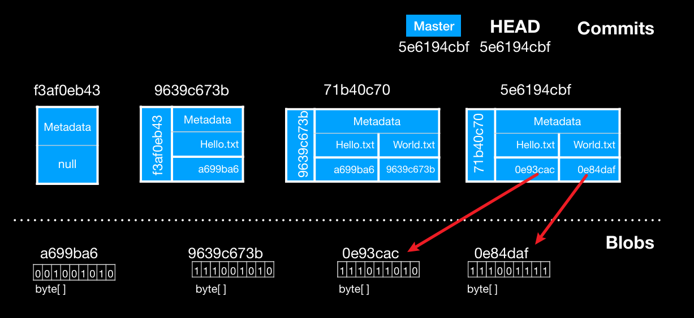
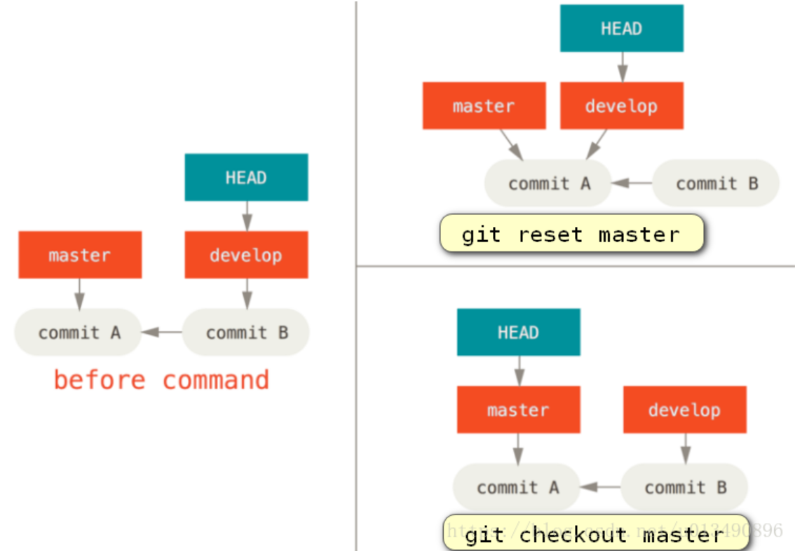

# Gitlet Design Document

**Name**:wzx

Date of Begin: 2025/7/29

Date of End: 2025/8/12

## Classes and Data Structures

### Commit (implements Serializable)

#### Instance

* ```java
  private String message;
  private Date timestamp;
// 使用List存储，因为在merge中会出现多个Parents
  private List<String> parents; 
  // 用于存储此Commit中修改的文件路径以及其哈希值
  // (key:value) --> (path:hashcode)
  private HashMap<String,String> filesandBlob; // hello.txt && hashcode
  
  
  ------------------------------------------
  |		| metadata: message && timestamp |
  |parent |---------------------------------
  |		|	Hashmap<String,String>		 |
  |		|	: <path:hashcode>			 |							 
  ------------------------------------------
  path: i.e hello.txt    
  hashcode: i.e 0e93cac    
      
  logic pic:
  --------------------------------------------------------------------------------------
         HEAD (.gitlet/HEAD) 
         --> refs/heads/..(i.e master) 
         --> Commit hashcode(i.e 5e6194cbf)
         --> .gitlet/objects/5e/6194cbf  (这里存储的是Commit class)
         --> readObject(Commit.class)  --> hashmap(i.e 0e93cac) 
         --> .gitlet/objects/0e/93cac... 
         --> readContent 
         --> 获得文件内容
  --------------------------------------------------------------------------------------
  ```
  




### Repository

#### Instance

* ```java
      /** The current working directory. */
  public static final File CWD = new File(System.getProperty("user.dir"));
    /** The .gitlet directory. */
  public static final File GITLET_DIR = join(CWD, ".gitlet");
  
      // mine instance
  public static final File OBJECTS = join(GITLET_DIR,"objects");
      /** The staging area*/
  public static final File STAGING_AREA = join(GITLET_DIR,"index");
  
      /** The staging area for removal*/
  public static final File REMOVE_INDEX = join(GITLET_DIR,"rm_index");
  
      /** storing  master*/
  public static final File REFS = join(GITLET_DIR,"refs");
  public static final File Heads = join(REFS,"heads");
      /** HEAD*/
  public static final File HEAD = join(GITLET_DIR,"HEAD");
  
      /** Remote instance*/
  public static final File CONFIG = join(GITLET_DIR,"config");
  public static final File FETCH_HEAD = join(GITLET_DIR,"FETCH_HEAD");
  public static final File REMOTES = join(REFS,"remotes");
  
  
  ```
  
* ~~~
  .gitlet
  	|
  	|---objects(dir)
  	|	    |
  	|		|---6a(initCommit)  ---> write/readObject(xxx,Commit.class)  (init)
  	|		|	|---7b...
  	|		|
  	|		|---4b(File content (Blob)) ---> write/readObject(xxx,byte[])   (add)
  	|		|	|---8d...
  	|		|
  	|		|---2d(new Commit)	(add)
  	|		|	|---3c
  	|		|
  	|		|
  	|		|---pull Commit && pull Blob also store here
  	|		|
  	|
  	|
  	|---index(暂存区) --> (文件路径:文件内容哈希值) i.e (wug.txt:...) sha1(contents) 
  	|				 --> write/readObject(xxx,Hashmap.class) (add)
  	|	  
  	|
  	|---rm_index(暂存区) --> (path) --> (xxx,HashSet.class) (rm)
  	|
  	|---refs
  	|	 |
  	|	 |--heads
  	|	 |	  |
  	|	 |	  |--master:Commit's hashcode
  	|	 |	  |	
      |	 |	  |--cool-beans: 
  	|	 |
  	|	 |
  	|	 |--remotes：
  	|	 |		|
  	|	 |		|--remoteName(i.e origin)
  	|	 |				|
  	|	 |				|--remoteBranchName(i.e main)
  	|	 |				|         |
  	|	 |				|  		  |--commit ID
  	|	 |				|
  	|
  	| 
  	|---config:hashmap:(remoteName,robustRemoteDir) (i.e origin:url)
  	|
  	|
  	|---HEAD:refs/heads/xxx
  	|
  	|
  	|---FETCH_HEAD: commitId remoteDir
  	|
  
  ~~~
  
  

#### function

* 
  
  ~~~markdown
  # 路径问题
  因为代码运行在CWD下，文件一般以相对路径的形式出现，i.e: wug.txt, files/wug.txt
  此时，f.getPath() 获得的也是相对路径，i.e: wug.txt, files/wug.txt
  因此，对于需要与存储的相对路径比较的文件名称，不用join(CWD,filename)
  
  # git reset 与 git checkout之间的区别
· 处理完成后，HEAD指针指向不同。
  
  # git reset 与 git checkout 删除未追踪文件规则
  ## 一般情况下untracked 定义为： 既没有add，也没有commit
  ## 本人认为这两个函数的删除规则与 rm 类似
  ## 对于没有Commit的文件，不能在本地删除，而只能删除暂存区的记录
  
  # 逻辑图注释
  --- : 解释
  --> : 下一步
  
  ~~~
  
  
  
  
  

### Utils

~~~java
# blob的内容
byte[] content = serialize();
// writeObject(file,content);
writeContent(file,content);


# hashcode
writecontent(file,hashcode)
    
    
# 数据结构
Commit commit // Hashmap hm
writeObject(file,commit/hm);
readObject(file,Commit.class/Hashmap.class)
~~~


## Algorithms

### findSplitPoint

~~~markdown
# 搜索策略：BFS:Use queue data structure help
## DFS NOT WORK HERE --> 使用迭代

logic pic:
------------------------------------------------------------------------
get one branch all history commit --- 存储在HashSet中
---> go through another branch history (BFS:use queue)
---> if Hashset.contains() --- it is the splitCommit ---> return
---> if not  ---> get Commit parents 
---> is visited.contains() ---> continue
---> if not  ---> add in the queue

---------------------------------------------------------------------------

~~~


